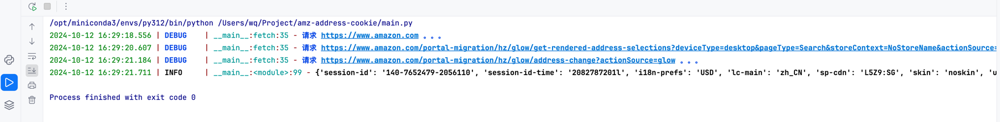

# 获取亚马逊邮编地址cookie

该项目可用于获取亚马逊指定邮编地址的cookie。
比如：

- 10008(US)
- K1N 6N5(CA)
- EC1A1HQ(UK)
- 01067(DE)
- ...

### 运行环境

`python3.12`

#### 安装项目依赖

```shell
pip install -r requirements.txt
```

运行

```shell
python main.py
```

